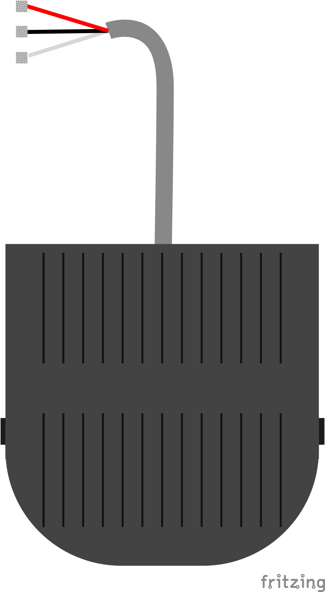

# ED(FS)-201-foot-switch-fritzing-part
## 喜歡請給個星星吧Orz
This is Foot switch fritzing part  
  
你可以自由使用這個fritzing part  
You are free to use this fritzing part(by giving me a star XD)  

請注意本圖示pcb部分請挑選自己合適的方案  
因為此元件本身就只有留三條導線  
所以pcb如何布局全看個人  
Please pay attention to the pcb part of this picture, please choose your own suitable solution  
Because this component only leaves three wires  
So how the PCB layout depends on the individual  
## datasheet
ED(FS)-201 foot switch  
Ui:400V  
Ith:10A  
Uimp:2.5kV  
AC-15  
AC250V/10A  
IP:65  
GB/T14048.5  
Produced by:ENDEDQ恩得  

[Official website](https://shop72323438.world.taobao.com/index.htm?spm=a312a.7700824.w5002-23012681725.2.57824630WxsrQr)

## MIT License

Copyright (c) 2021 HuangYuTse

Permission is hereby granted, free of charge, to any person obtaining a copy
of this software and associated documentation files (the "Software"), to deal
in the Software without restriction, including without limitation the rights
to use, copy, modify, merge, publish, distribute, sublicense, and/or sell
copies of the Software, and to permit persons to whom the Software is
furnished to do so, subject to the following conditions:

The above copyright notice and this permission notice shall be included in all
copies or substantial portions of the Software.

THE SOFTWARE IS PROVIDED "AS IS", WITHOUT WARRANTY OF ANY KIND, EXPRESS OR
IMPLIED, INCLUDING BUT NOT LIMITED TO THE WARRANTIES OF MERCHANTABILITY,
FITNESS FOR A PARTICULAR PURPOSE AND NONINFRINGEMENT. IN NO EVENT SHALL THE
AUTHORS OR COPYRIGHT HOLDERS BE LIABLE FOR ANY CLAIM, DAMAGES OR OTHER
LIABILITY, WHETHER IN AN ACTION OF CONTRACT, TORT OR OTHERWISE, ARISING FROM,
OUT OF OR IN CONNECTION WITH THE SOFTWARE OR THE USE OR OTHER DEALINGS IN THE
SOFTWARE.